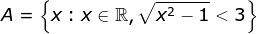
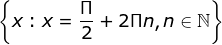
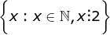
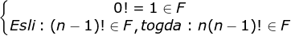
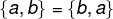
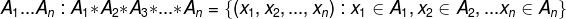

### 1. Теория множеств
1. [Способы задания множеств. Универсальное, конечное, пустое, равные множества. Включения и подмножества. Диаграмма Эйлера–Венна. Мощность конечного множества.](#Ответ-1)
2. [Операции над множествами. Свойства операций над множествами.](#Ответ-2)
3. [Упорядоченные пары и кортежи. Прямое (декартово) произведение множеств, его свойства и геометрическая интерпретация.](#Ответ-3)
4. [Отображения и соответствия. Инъективное, сюръективное, биективное отображения. Обратное соответствие. Сечение соответствия.](#Ответ-4)
5. [Способы задания соответствий. Бинарные отношения. Способы задания бинарных отношений.](#Ответ-5)
6. [Свойства бинарных отношений: рефлексивность, иррефлексивность, симметричность, антисимметричность, транзитивность, плотность. График отношения.](#Ответ-6)
7. [Классы отношений: эквивалентность, толерантность. Отношения порядка.](#Ответ-7)
8. [Разбиение множества. Классы эквивалентности. Фактор-множество. Связь понятий отображения, разбиения, эквивалентности.](#Ответ-8)
9. [Отношения порядка и сопоставленные им отношения. Упорядоченные множества.](#Ответ-9)
10. [Наибольший, максимальный, наименьший, минимальный элементы упорядоченного множества. Верхние и нижние грани множества. Точные верхняя и нижняя грани. Принцип двойственности для упорядоченных множеств. Вполне упорядоченное множество.](#Ответ-10)
11. [Индуктивные упорядоченные множества. Теорема о неподвижной точке.](#Ответ-11)
12. [Диаграммы Хассе для конечных упорядоченных множеств.](#Ответ-12)
13. [Мощность множеств. Отношение равномощности. Счетные множества. Нумерации.](#Ответ-13)
14. [Свойства счетных множеств. Равномощные множества.](#Ответ-14)
15. [Свойства счетных множеств при сравнении их мощностей. Теорема Кантора–Бернштейна. Теорема о квадрате.](#Ответ-15)
16. [Композиция соответствий: понятие и порядок построения.](#Ответ-16)
17. [Обобщенная композиция соответствий. Свойства композиции соответствий. Композиция бинарных отношений.](#Ответ-17)

### 2. Теория Графов

18. [Понятие графа. Ориентированные и неориентированные графы. Мультиграф. Простой, полный, двудольный (граф Кёнига), дополнительный графы.](#Ответ-18)
19. [Отношения смежности и инцидентности в графах. Порядок графа, степень и полустепени вершин. Изоморфизм графов.](#Ответ-19)
20. [Способы задания графов. Части графа: подграфы и суграфы.](#Ответ-20)
21. [Теоретико-множественные операции на графах.](#Ответ-21)
22. [Маршрут, цепь, цикл, путь, контур в графе. Прямое и обратное транзитивные замыкания.](#Ответ-22)
23. [Понятие связности. Простая и сильная связность. Компонента связности. Алгоритм Мальгранжа разложения орграфа на компоненты связности.](#Ответ-23)
24. [Соответствие понятий маршрута и связности. Точка сочленения графа и теорема о ней. i-связный граф.](#Ответ-24)
25. [Порядковая функция орграфа без контуров. Метод Демукрона отыскания порядковой функции орграфа.](#Ответ-25)
26. [Внутренняя и внешняя устойчивость вершин графа. Определение устойчивых подмножеств вершин графа при помощи функции Гранди.](#Ответ-26)
27. [Раскраска графа: постановка задачи, способы решения. Хроматическое число графа. Теорема Кёнига.](#Ответ-27)
28. [Клика. Максимальная и наибольшая клики. Кликовое число. Алгоритм отыскания максимальной клики в неографе.](#Ответ-28)
29. [Эйлеров обход в графе. Доказательство теоремы (Эйлера) об эйлеровом цикле в связном неографе. Алгоритм Флёри построения эйлерова цикла в связном неографе.](#Ответ-29)
30. [Гамильтоновы графы. Классические задачи о гамильтоновом цикле. Теорема Оре о гамильтоновом графе.](#Ответ-30)
31. [Эйлеровость и гамильтоновость в орграфах.](#Ответ-31)
32. [Паросочетания. Задача о назначениях. Двудольные графы.](#Ответ-32)
33. [Планарные графы. Понятие грани. Теорема Эйлера о плоском графе и следствия из нее. Теорема «о пяти красках».](#Ответ-33)
34. [Гомеоморфизм графов. Теорема Понтрягина–Куратовского о планарном графе. Искаженность и толщина графа.](#Ответ-34)
35. [Деревья. Основные свойства деревьев. Ориентированные деревья. Бинарные деревья. Дерево решений.](#Ответ-35)
36. [Остовы. Циклический и коциклический ранги. Задача Штейнера.](#Ответ-36)
37. [Задача об остове экстремального веса. Алгоритм Прима.](#Ответ-37)
38. [Кратчайшие пути в графе: постановка задачи. Отыскание кратчайшего пути в невзвешенном графе.](#Ответ-38)
39. [Алгоритм Форда отыскания кратчайшего пути во взвешенном графе.](#Ответ-39)
40. [Алгоритм Дейкстры отыскания кратчайшего пути во взвешенном графе.](#Ответ-40)
41. [Поток в транспортной сети: постановка задачи. Полный и максимальный поток в сети. Увеличивающая цепь и алгоритм ее построения.](#Ответ-41)
42. [Понятие разреза транспортной сети. Минимальный разрез. Теорема Форда– Фалкерсона о максимальном потоке в сети. Алгоритм Форда–Фалкерсона отыскания экстремального потока в сети.](#Ответ-42)

### 3. Булевы функции

43. [Понятие булевой функции. Способы задания булевых функций. Существенные и несущественные переменные. Элементарные булевы функции одной и двух переменных.](#Ответ-43)
44. [Логические формулы. Соотношение понятий функции и формулы. Булев базис и булева алгебра. Свойства булевых операций.](#Ответ-44)
45. [Алгебра и полином Жегалкина. Свойства операций базиса Жегалкина. Приведение булевой функции к полиномиальному представлению в базисе Жегалкина. Теорема о полиноме Жегалкина.](#Ответ-45)
46. [Дизъюнктивная и конъюнктивная нормальные формы булевых функций. Методика приведения булевой функции, заданной произвольной формулой, к ДНФ и КНФ.](#Ответ-46)
47. [Совершенные ДНФ и КНФ. Методика приведения булевой функции к СДНФ и СКНФ.](#Ответ-47)
48. [Минимизация булевых функций: постановка задачи. Импликанты. Простые импликанты. Сокращенная, тупиковая и минимальная формы булевой функции (в классе ДНФ).](#Ответ-48)
49. [Этапы получения минимальной ДНФ булевой функции. Единичный гиперкуб. Геометрическая интерпретация задачи минимизации булевой функции.](#Ответ-49)
50. [Метод диаграмм Вейча (карт Карно) минимизации булевой функции в классе ДНФ. Обоснование сокращения ранга покрывающих импликант в методе диаграмм Вейча.](#Ответ-50)
51. [Метод Квайна–Мак-Класки минимизации булевой функции в классе ДНФ.](#Ответ-51)
52. [Классы Поста булевых функций: сохраняющих константу нуля и константу единицы, линейных и монотонных.](#Ответ-52)
53. [Двойственность булевых функций. Способ отыскания функции, двойственной к заданной. Теоремы о двойственности. Класс Поста самодвойственных функций.](#Ответ-53)
54. [Замкнутый класс. Полные системы булевых функций. Теорема Поста. Примеры полных систем булевых функций.](#Ответ-54)
55. [Порядок доказательства полноты произвольной системы булевых функций.](#Ответ-55)

### 4. Ответы
####  1. Способы задания множеств. Универсальное, конечное, пустое, равные множества. Включения и подмножества. Диаграмма Эйлера–Венна. Мощность конечного множества.
* *Способы задания множеств*
	* 	Перечисление элеметов: возможно, когда количество элементов небольшое и конечное.
	*  Указание общего свойства элементов множества:
		*  
		*   , где P(x) - характеристический предикат.
	*  используют другое множество, заранее известное, например:
		*  
		*   - только чётные.
	*  используют процедуру (рекурсивную), пораждающие элементы множества, например: 
		*   - числа Фибоначи.

* *Множества*:
	- Унивесальное - U - множество, включающее в себя все множества.
	- Конечное - множество состоящее из конечного числа элементов.
	- Бесконечное - множество состоящее из бесконечного числа элементов.
	- Пустое - множество не содержащее ни одного элемента.
	- Множество B называют подмножеством множества A, если каждый элемент множества B является элементом множества A. B включено в A или  
	-  - строгое включение.
	- Множества A и B называются равными или A = B, тогда и только тогда, когда 

- *Свойства включений (подмножеств)*:
	-  - множество А является собственным включением.
	- Транзитивность 
	- Объединение
	- Пересечение
	- Разность
	- Cимметрическая разность
	- Дополнение

<— Вставить картинки!! —>

- *Диаграмма Эйлера-Венна*:
	- Диаграмма Эйлера-Венна - илюстрация, использующаяся для наглядного представления множества/опреации над множествами. Примеры показаны в свойствах.

- *Мощность конечного множества*:
	- Мощность множества - количество его элементов, обозначается: |А|.
	- Если между множествами А и В устанавливается взаимооднозначное соответствие, то эти множества содержат одинаковое количество элементов. Такие множества - равномощные.
	- Если у множества А нет равномощного собственного подмножества, то множество А - конечное.
	- Для конечного множества А, его . Все остальные множества являются бесконечными и их мощность равна бесконечности.
	- Теорема: Множество имеющее бесконечные подмножества само бесконечно. Следствие: Все подмножества конечного множества конечны.

<- Вставить картинку подсчета мощности множества. -> 
	 
#### 2. Операции над множествами. Свойства операций над множествами.

- *Операции над множествами*:
	- Объединение
	- Пересечение
	- Разность
	- Симметрическая разность
	- Дополнение
		- <— Вставить картики!! —> 

- *Свойства операций над множествами*: 
	- тоже легче картиками 

#### 3. Упорядоченные пары и кортежи. Прямое (декартово) произведение множеств, его свойства и геометрическая интерпретация.

- *Упорядоченные пары и кортежи*:
	-  - неупорядоченная пара.
	-  - кортеж, упорядоченная пара.
Обобщением упорядоченной пары называется упорядоченный кортеж или просто кортеж.
	- Множество всех кортежей длины n на множествах  называют декартовых или прямых произведений.
	- 
	- Декартово или прямое произведение множеств - множество упорядоченных кортежей.
	-  - n-ая декартовая степень А.
	- Мощность произведения: 
	- Пример:<--Прикр картинку примера см 2 лекц начало--> 
	- Свойства:
		- ;
		- ;
		- ;
		-  не обладает особыми свойствами.

#### 4. Отображения и соответствия. Инъективное, сюръективное, биективное отображения. Обратное соответствие. Сечение соответствия.

- *Отображение и соответствия*:
	- Отображение f из множества А в множество В задано, если каждому элементу  сопоставим  или по другому: .
	- Каждое отображение однознано задает множество однородных пар . Такое множество пар называют графиком отображения f. В общем случае для отображения f может существовать несколько различных элементов из множества А, которыс соответствует один и тот же элемент из множества В .
	- Множество всех элементов

#### 5. Способы задания соответствий. Бинарные отношения. Способы задания бинарных отношений.
#### 6. Свойства бинарных отношений: рефлексивность, иррефлексивность, симметричность, антисимметричность, транзитивность, плотность. График отношения.
#### 7. Классы отношений: эквивалентность, толерантность. Отношения порядка.
#### 8. Разбиение множества. Классы эквивалентности. Фактор-множество. Связь понятий отображения, разбиения, эквивалентности.
#### 9. Отношения порядка и сопоставленные им отношения. Упорядоченные множества.
#### 10. Наибольший, максимальный, наименьший, минимальный элементы упорядоченного множества. Верхние и нижние грани множества. Точные верхняя и нижняя грани. Принцип двойственности для упорядоченных множеств. Вполне упорядоченное множество.
#### 11. Индуктивные упорядоченные множества. Теорема о неподвижной точке.
#### 12. Диаграммы Хассе для конечных упорядоченных множеств.
#### 13. Мощность множеств. Отношение равномощности. Счетные множества. Нумерации.
#### 14. Свойства счетных множеств. Равномощные множества.
#### 15. Свойства счетных множеств при сравнении их мощностей. Теорема Кантора–Бернштейна. Теорема о квадрате.
#### 16. Композиция соответствий: понятие и порядок построения.
#### 17. Обобщенная композиция соответствий. Свойства композиции соответствий. Композиция бинарных отношений.
#### 18. Понятие графа. Ориентированные и неориентированные графы. Мультиграф. Простой, полный, двудольный (граф Кёнига), дополнительный графы.
#### 19. Отношения смежности и инцидентности в графах. Порядок графа, степень и полустепени вершин. Изоморфизм графов.
#### 20. Способы задания графов. Части графа: подграфы и суграфы.
#### 21. Теоретико-множественные операции на графах.
#### 22. Маршрут, цепь, цикл, путь, контур в графе. Прямое и обратное транзитивные замыкания.
#### 23. Понятие связности. Простая и сильная связность. Компонента связности. Алгоритм Мальгранжа разложения орграфа на компоненты связности.

	Граф является связным тогда и только тогда, когда 2 любые различные его вершины соеденены маршрутом.
	Простая связность - маршруты включают и прямые и обратные дуги.
	Сильная связность - маршруты при посторении учитывают направление дуг (не используют обратные дуги)
		Оргаф называется сильно связаным, если для любой вершины Si множетсва S выполняется: (png/23-1.png)
		Подграф (png/23-2.png) наз максимально сильносвязаным, если (png/23-3.png) так же сильно связанного
		Т.о. максимально сильносвязные подграфы G образубт классы эквивалентности C1,C2,C3,...,Ce, на которые разбивается граф G
	C1,C2,C3,...,Ce являются компонентами связности орграфа.
	
	Алгоритм Мальгранжа: 
		В осное алгоритма идея - каждая Si графа может приадлежать только одному классу эквивалентности.
		Основная формула алгоритма Мальгранжа: (png/23-5.png)
	
#### 24. Соответствие понятий маршрута и связности. Точка сочленения графа и теорема о ней. i-связный граф.
#### 25. Порядковая функция орграфа без контуров. Метод Демукрона отыскания порядковой функции орграфа.
#### 26. Внутренняя и внешняя устойчивость вершин графа. Определение устойчивых подмножеств вершин графа при помощи функции Гранди.
#### 27. Раскраска графа: постановка задачи, способы решения. Хроматическое число графа. Теорема Кёнига.
#### 28. Клика. Максимальная и наибольшая клики. Кликовое число. Алгоритм отыскания максимальной клики в неографе.
#### 29. Эйлеров обход в графе. Доказательство теоремы (Эйлера) об эйлеровом цикле в связном неографе. Алгоритм Флёри построения эйлерова цикла в связном неографе.
#### 30. Гамильтоновы графы. Классические задачи о гамильтоновом цикле. Теорема Оре о гамильтоновом графе.
#### 31. Эйлеровость и гамильтоновость в орграфах.
#### 32. Паросочетания. Задача о назначениях. Двудольные графы.
#### 33. Планарные графы. Понятие грани. Теорема Эйлера о плоском графе и следствия из нее. Теорема «о пяти красках».
#### 34. Гомеоморфизм графов. Теорема Понтрягина–Куратовского о планарном графе. Искаженность и толщина графа.
#### 35. Деревья. Основные свойства деревьев. Ориентированные деревья. Бинарные деревья. Дерево решений.
#### 36. Остовы. Циклический и коциклический ранги. Задача Штейнера.
#### 37. Задача об остове экстремального веса. Алгоритм Прима.
#### 38. Кратчайшие пути в графе: постановка задачи. Отыскание кратчайшего пути в невзвешенном графе.
#### 39. Алгоритм Форда отыскания кратчайшего пути во взвешенном графе.
#### 40. Алгоритм Дейкстры отыскания кратчайшего пути во взвешенном графе.
#### 41. Поток в транспортной сети: постановка задачи. Полный и максимальный поток в сети. Увеличивающая цепь и алгоритм ее построения.
#### 42. Понятие разреза транспортной сети. Минимальный разрез. Теорема Форда– Фалкерсона о максимальном потоке в сети. Алгоритм Форда–Фалкерсона отыскания экстремального потока в сети.
#### 43. Понятие булевой функции. Способы задания булевых функций. Существенные и несущественные переменные. Элементарные булевы функции одной и двух переменных.
#### 44. Логические формулы. Соотношение понятий функции и формулы. Булев базис и булева алгебра. Свойства булевых операций.
#### 45. Алгебра и полином Жегалкина. Свойства операций базиса Жегалкина. Приведение булевой функции к полиномиальному представлению в базисе Жегалкина. Теорема о полиноме Жегалкина.
#### 46. Дизъюнктивная и конъюнктивная нормальные формы булевых функций. Методика приведения булевой функции, заданной произвольной формулой, к ДНФ и КНФ.
#### 47. Совершенные ДНФ и КНФ. Методика приведения булевой функции к СДНФ и СКНФ.
#### 48. Минимизация булевых функций: постановка задачи. Импликанты. Простые импликанты. Сокращенная, тупиковая и минимальная формы булевой функции (в классе ДНФ).
#### 49. Этапы получения минимальной ДНФ булевой функции. Единичный гиперкуб. Геометрическая интерпретация задачи минимизации булевой функции.
#### 50. Метод диаграмм Вейча (карт Карно) минимизации булевой функции в классе ДНФ. Обоснование сокращения ранга покрывающих импликант в методе диаграмм Вейча.
#### 51. Метод Квайна–Мак-Класки минимизации булевой функции в классе ДНФ.
#### 52. Классы Поста булевых функций: сохраняющих константу нуля и константу единицы, линейных и монотонных.
#### 53. Двойственность булевых функций. Способ отыскания функции, двойственной к заданной. Теоремы о двойственности. Класс Поста самодвойственных функций.
#### 54. Замкнутый класс. Полные системы булевых функций. Теорема Поста. Примеры полных систем булевых функций.
#### 55. Порядок доказательства полноты произвольной системы булевых функций.
