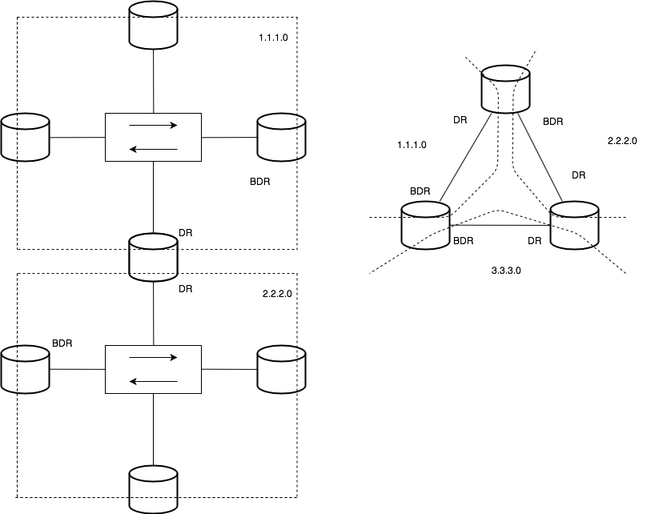
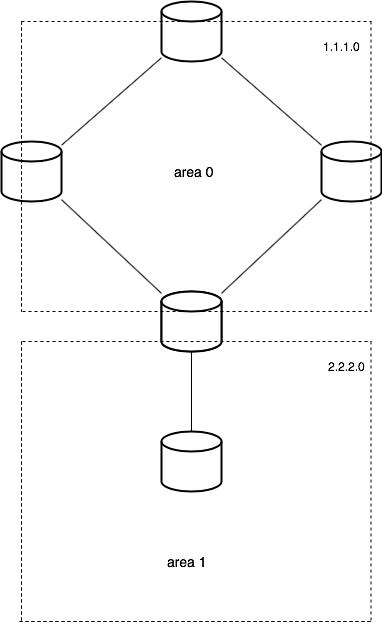
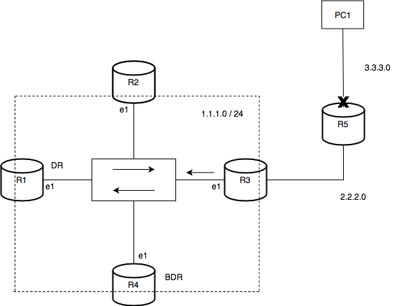
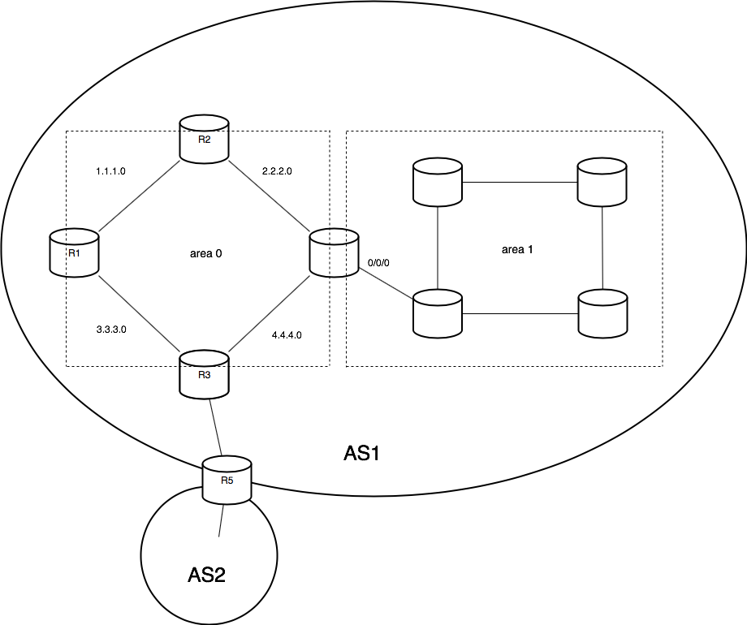
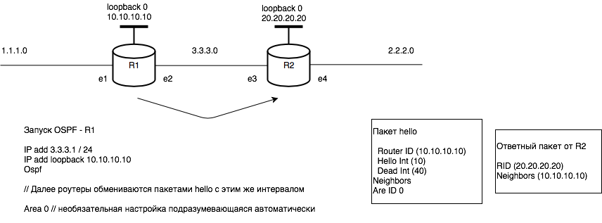

#### Лекция (28.09.2018)

Плоские Сети

__Среда передачи__ - физический уровень.

__Критерий Надежности__ - уровень надёжности

Уровни OSI:

1.  Физический
2. Канальный
3. Сетевой
4. ...

Hub или Коммутатор может быть L2 или L3. 

- L1 - Битовый
- L2 - Канальный - frames - mac
- L3 - Сетевой - IP-addres

##### Терминология

__Динамическая маршрутизация__ - нахождение наилучшего маршрута из всех существующих.

__eBGP__ - Сложная система

__Коаксиальные линии__ передачи - просто пучок медных проводов

|MB/s||сечение|Дальность|
|---|---|---|---|
|10|base 2|Thin Coax|185 м|
|10|base 5|Thick Coax|500 м|

BNC - __Bagonet__ Neill Concilman - 

Ethernet

|MB/s||Раст-ие затух.сигн.|Витая пара||
|---|---|---|---|---|
|10|base - T|100|1|cat 3|
|100|base - TX|100|2|cat 5|
|1000|base - T|100|4|cat 5l|

Оптика

|MB/s||Дальность||
|---|---|---|---|
|10|base - f|2 км||
|100|base - fx|2 км||
|1000|base - lx|5 км|одномодовый|
|1000|base - fx|550 м|многомодовый|

__Последовательный интерфейс__

RS-232 - 20k bps
RS-422 - 1000кв - 10Mb

__Домен коллизий__

---
#### Лекция (05.10.2018)

__Схемы построения сети__

__Протокол SP3__

---
#### Лекция (12.10.2018)

---
#### Лекция (19.10.2018)

---
#### Лекция (26.10.2018)

##### OSPF - Open Shortest Path First

Роутер в OSPF собирает полную топологию сети в той подсети, в которой он находится.

|№|Типы пакетов|Состояние портов|Типы устройств|Таймеры|Типы Зон|
|---|---|---|---|---|---|
|1|hello : Router ID (10.10.10.10), Hello Int - (10), Dead Int - (40) |DOWN|DR - designated router - его задача отправлять в систему инфо об изменении топологии|Hello Int - 10 sec|Backbone Area/ Area 0|
|2||INIT|BDR - backup designated router|Dead Int - 4*HI - 40 sec|Stub Area|
|3||TwoWay - выбор DR|ABR - Area Border Router. Конечный роутер в подсети||Все остальные|
|4||ExStart - выбор DR|ASBR - Autonom System Border Router||
|5||Exchange - отправка пакетов DBD|||
|6||Loading|||
|7||Full|||

DR, BDR - это значение не роутера, а порта роутера. Один роутер может быть и DR и BDR. 

Один роутер может принадлежать нескольким областям портами, так как области принадлежат порты. 

Когда падает линк, R3 передает пакет LS Update на unicast'овый адрес равный 224.0.0.6 - Передаёт эту инфорацию на DR (224.0.0.5 - Multicast адрес : такой адрес, который задан в данной подсети на элементах, на которых запущен OSPF. Используется для передачи измененной информации от DR ко всем остальным роутерам с OSPF).  

BDR нужен для того чтобы заменить DR, если он отключится. Замена происходит мнгновенно. Если BDR отключается при работающем DR, новый BDR выбирается мгновенно. Отключение обоих роутеров одновременно - главный страх сетей OSPF :)

Выбор DR происходит по наименьшему: (приоритет)

- router-id
- loopback 0 (на практике используется этот)
- id interface'а

Определения:

- __LSDB__ - Link State DB
- __SPF__ - ф-ия мат-кая из всех известных маршрутов выбирает лучший
- __Area ID__ - по умолчанию 0, иначе можно настроить руками. 
- __LS Update__ - обновление LSDB -> таблица маршрутизации
- __AS__ - автономная система

Вернемся к запуску __OSPF__

	[r3] OSRF 1
	[r3] area 0
	[r3-area0] network 2.2.2.0 0.0.0.255
	[r3-area0] network 3.3.3.0 0.0.0.255
	:
	[r3-area1] network 2.2.2.0 0.0.0.255 

---
#### Лекция (02.11.2018)

|routed|routing|
|---|---|
|С помощью чего|Нахождение маршрута|
|IP, IPx|OSPF, RIP, IF-IF, BGP|

__RIP__ снова ;)

Ну в общем, RIP занимается обменом информации о маршрутах между устройствами, его взаимодействие зависит от количества переходов м ежду устройствами, у есть своя табл маршрутизации. Изачально: табл маршрутизации, записи прямях переходов. 

Настройка роутера R2 под RIP
	
	 [] rip 1
	 [ ] version 1 //задается для отображения в  current config
	 [ ] network 2.0.0.0
	 [ ] network 1.0.0.0 //идет запись в табл маршрутизации 
	 [ ] // предположим что на R1 R3 уже RIP настроен
	 [ ] // роутер формирует hello пакет, который он отправляет всем подключенным роутерам 

В RIP 1 максимальная длина - 15 hop 

