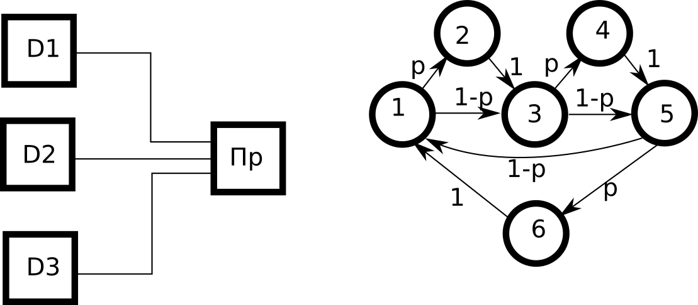
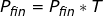
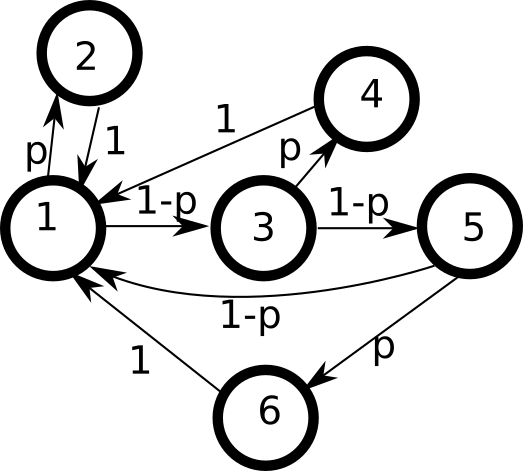
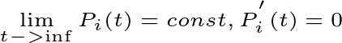
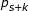
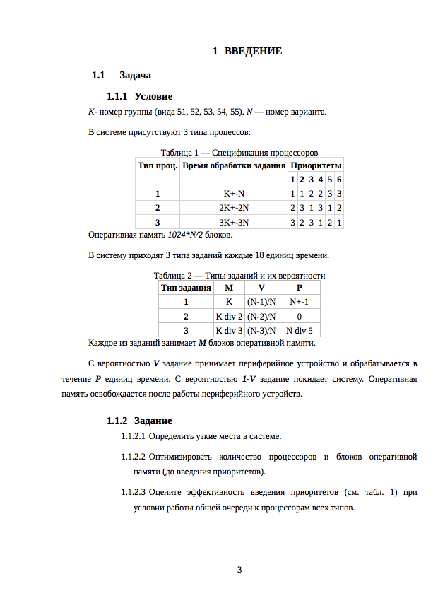

### Лекция 1 (03.09.2018)

	Вводная информация о курсе:
	
	Ведёт: Шайхутдинов Артур
	Почта: artur@shaikhutdinov.ru
	3 РК - 70 баллов + Экзамен
	3 Модуля
	- Математические модели - Теоретическое обоснование резульатов моделирования
	- Индукционное моделирование - системы массового обслуживания
	- Поиск неисправностей логических схем
	Семинары: 1 раз в 2 недели
	Лаб. Работы: 4 Работы, по 2 пары
	Шайх может только в ЧТ 	СР
		08.30-12.00
		12.00-15.40
		15.40-19.00
	Начнём лабы с 3й недели
	2 ДЗ - по Модулям 2 и 3
	
	Далее в таких серых прямоугольничках будут примеры (будут помечаться #)
	Также примеры будут вставлены картинкой 

---

Процесс моделирования

 - Формармальная постановки задачи
 - Составление компьютерной модели
 - Серия компьютерных экспериментов
 - Результат, ответ на поставленных вопрос
 - Оценка достоверности
 
##### Таблица 1. Уровни и средства проектирования на этих уровнях

|Уровни детализации проекта| Объекты действия  |  Решаемые задачи     |Средства проектирования|
|---|---|---|---|
|Системный	| Процессоры, Блоки питания, Каналы передачи данных, Переферийные устройства, др. крупные блоки   | Синтез структурной схемы(архитектуры), Определение требований к объектам|Средства анализа|
|Функционально-логический : Уровень регистровых передач|Регистры, Регистровые массивы, АЛУ, Функциональные блоки|Синтез регистровых структур, Формирование алгоритмов функционирования|Средства синтеза регистровых структур по алгоритмам функционирования, Анализ в многозначных алфавитах|
|Функционально-логический : логический|Логические элементы в принятом базисе|Синтез логической схемы, Синтез тестов|Средства синтеза и анализа логической схемы в многозначных алфавитах|
|Схемотехнический|Объекты принципиальной эл. схемы|Сиинтез принципиальной эл. схемы|Средства анализа в многозначных алфавитах|
|Компонентный|Участки полупроводникового кристала|Разработка топологии кристала|Средства анализа|
|Конструкторский|Элементы конструкции|Троссировка и размещение|Средства анализа, Моделирование|

							
##### Таблица 2. Цикл устранения дефектов для различных реализаций ЭВМ
|ЭВМ на| ЭВМ на СИС	| ЭВМ на микропроцессорах| ЭВМ на МаБИС| БИС на стандартных ячейках|Полностью заказные БИС|
|---|---|---|---|---|---|
|Метод устранения дефектов|Замена микросхем|Перепрограммирование ПЗУ (перепрошивка)|Перепроектирование и изготовление заново|Перепроектирование и изготовление заново|Перепроектирование и изготовление заново|
|Цикл устранения календарный|0.5-1 день|1-2 дня|4-10 недель|8-20 недель|1 год|
|Цикл устранения относительный|1|4|50|100|1000|
|Относительный уровень бездефектного проектирования|50%|60%|75%|90%|98% *|

 *Достигается моделированием и тестированием на всех уровнях проектирования (в соответствии с Табл.1) 

#### МОДУЛЬ 1. Аналитические модели вычислительных систем (ВС)

1. Марковские модели(процессы)

Все математические модели относятся к классу вероятностных моделей, т.е. их результаты можно оценивать статистически. Существуют сильная и слабая связь между событиями. 
	
Если вероятность события P(Ak) в j-м испытании зависит только от события Ak в j-1м испытании, и не зависит от всех предшевствующих событий, то связь называется __слабой__, а последовательность испытаний представляет собой __цепь Маркова__.
	
__Цепь Маркова__ - одна из реализций Марковского случайного процесса. 

Описать Марковский процесс можно с помощью __вектора начального состояния и матрицы переходов__, или __графом__.

__Вершинами графа__ ясвляются состояния Марковского случ. процесса. __Рёбра__ обозначают переходы между состояниями. __Вес ребра__ - вероятность перехода на каждом шаге. Граф является взвешеным орграфом

__Базовая задача Марковской цепи__ - определение финальных вероятностей. 

__Финальная вероятность__ - вероятность, с которой система может оказаться в одном из своих N состояний.

	# Финальная вероятность
	P0 = (P01; P02)
	1)P(1)1 = P01
	  P(1)2 = P02
	2)P(2)1 = P(1)1*P11 + P(1)2 * P21
	  P(2)1 = P(1)1*P12 + P(1)2 * P22
	3)...
	При j->inf
	(P(j)1...P(j)2) = (P(j+1)1...P(j+1)2)
	Вероятность практически перестаёт меняться

### Лекция 2 (10.09.2018)

#### Способ 1 - последовательный опрос
p - вероятность информации для обработки

#### Случай 2
После обработки возвращаемся к опросу, только потом переходим к следующему Датчику

#### Модели систем массового обслуживания.

__СМО__ - система массового обслуживания.
СМО состоит из следующих элементов:

- Буфферная память
- Обслуживающий аппарат
- Требования (заявка|тразакция) - динамические эл-ты СМО

__Динамические эл-ты__ - эл-ты, которые могут перемещаться в памяти СМО. 

Входной поток требований -> Буф. Память -> ОА -> Вых. поток требований
(Одноканальная однофазная СМО с буферной паматью)

БП бывает приорететной и безприорететной. БП определяет очередь требований. Для БП должна быть задана дисциплина обслуживания.

ОА так же называются каналами, занимаются обслуживанием транзактов, что выражается временной задержкой транзактов в этом блоке.

__Фаза__ - паралельно подключённые ОА. 
__Канал__ = ОА, кол-во ОА в фазе - канальность.
В каждом ОА может обслуживаться один транзакт единовременно.
Если присутствует БП, то СМО назывют "системой с ожиданием и потерями". 

Задать систему в виде модели СМО значит задать:

  1. Закон входного потока - закон, определяющий диапазон времени между приходом требований в систему
  2. Механизм обработки
    3.  Закон изменения диапазона времени, требуемого для обработки требования в ОА
    4. Моменты времени когда обработка допускается.
    5. Количество одновременно обрабатываемых требований (Канальность каждой фазы
  6. Дисциплина выборки (для всех БП) - безприоритетная, приорететная, с абсолютным и относительным приорететом, с задержкой.

__Моделирование входного потока__

Свойства простейшего входного потока:

1. Одинарность - в один момент времени или за малый промежуток времени в систему может войти не более одного транзактов
2. Стационарность - вероятность прихода ровно k требований V_k за интервал a+dT зависит только от величины интервала dT и не зависит от расположения на оси времени a
3. Отсутвие последействие - Количество требований за интревал времени не зависит от количества вошедших до этого момента требований
Поток, обладающий этими 3мя свойствами, является простейшим 

При n -> inf

![\\ \theta^{\frac{k}{n}} \geq V_0(t) \geq \theta^{\frac{k+1}{n}} 
\\lim_{n->\infty}V_0(t)=\theta
\\ \theta = e^{-\lambda},\lambda \geq 0
\\V_0(t) = e^{-\lambda t} = 1-\lambda t + \frac{(\lambda t)^2}{2!} - \frac{(\lambda t)^3}{3!}
\\V_0(t) = 1 - \lambda t, t->0
\\V_k(t+ \tau )
\\V_0(\tau ) + V_1(\tau ) = 1
\\ V_k(t+ \tau) = V_k(t) * V_0(\tau)+V_{k-1}(t)+...+V_0(t)V_k(\tau)
\\V_k(t+ \tau) = V_k(t) * V_0(\tau)+V_{k-1}(t)V_1(\tau) = V_k(t)(1-\lambda \tau) + V_{K-1}\lambda \tau
\\ \frac{V_k(t+\tau) - V_k(t)}{\tau} = -\lambda *V_k(t)* \lambda V_{k-1}(t)
\\V_{k}^{'} = -\lambda (V_k(t) - V_{k-1}(t))](files/2_10.png)

### Лекция 3 (17.09.2018)

![V_k = \frac{(\lambda t )^k * e^{-\lambda t}}{k!}
\\
\\M[k] = \sum_{k->0}^{inf} k*v_k(t) = \sum_{k->0}^{inf} k* \frac{(\lambda t )^k * e^{-\lambda t}}{k!} = (\lambda t ) * e^{-\lambda t} * \sum_{k->0}^{inf} \frac{(\lambda t)^{k-1}}{(k-1)!} = \lambda t * e^{-\lambda t} * e^{\lambda t} = \lambda t](files/3_1.png)

Si - занято i каналов

Что то с доски, и оно должно быть тут

![\\
P_k (t + \Delta t) = P_k(t) * V_0(\Delta t) * (1- \mu \Delta t)^k + P_{k-1}(t)* \lambda \Delta t *(1- \mu \Delta t)^{k-1} +P_{k+1}(t) *(1- \mu \Delta t) * (k+1)\mu \Delta t 
\\
\Delta t^2 -> 0
\\
(1 - \mu \Delta t) \approx 1 - k \mu \Delta t
\\
(1 - \lambda \Delta t)(1 - k\mu \Delta t) \approx 1 - \lambda \Delta t - k \mu \Delta t
\\
P_k (t+ \Delta t) = P_h(t) -  \lambda \Delta t P_k (t) - k \mu \Delta t P_k(t) + P_{k-1}(t)*\lambda \Delta t + P_{k+1}(t)*(k+1)\mu \Delta t
\\
P_k^{'}(t) = - \lambda P_k (t) - k \mu P_k (t) + P_{k-1}(t)\lambda + P_{k+1}(t)(k+1)\mu (2)
\\
P_r(t+\Delta t) = P_r (t) * (1 - \mu \Delta t)^r+ P_{r-1}(t) * \lambda \Delta t * (1 - \mu \Delta t)^{r-1}
\\
P_r^{'} = -r \mu P_r (t) + P_{r-1} (t)\lambda (3)
\\
t = 0: P_0(t) = 1, P_1(t) =...,P_r(t) = 0
\\ 
\sum^{r}_{k->0} P_k(t) = 1](files/3_3.png)

А теперь график

В установившемся режиме система Чепмена-Колмогорова содержит слева нули.

__Стационратная вероятность__ - отсносительная доля времени, в котором система нахлдится в данном состоянии
Тех харки СМО

1. Вероятность потерь - в течение какой доли времени мы можем терять эти требования. P_{lost} = Pr
2. Пропускная способность - доля времени, в течение которого система обслуживала требования. q = 1 - Pr
3. Абсолютная пропустканая способность. A = \lambda * q = \lambda (1-Pr)

S0 - ОА свободен, свободно n ячеек ВП

Формирующее правило - производная вероятность нахождения системы в данном состоянии равна алгебраической сумме такого количества вероятностей, сколько дуг связанно с этим состоянием. Знак слогаемого определяется направлением дуги (Исх -, Вход +). Каждое слогаемое равно произведению вероятности состояния из которого дуга исходит на интенсивность перехода по этой дуге.

Система уравнений n - Чепмена-Колмогорова

### Лекция 4 (24.09.2018)

Система уравнений Чепмена-Колмогорова

, где  - средняя длинна очереди. 

#### Имитационное моделирование информационных систем.

2 независимые случайные величины:

1. Интервал времени между приходами требований во входящем потоке
2. Интервал времени обслуживания требования в ОА
	
Св-ва системы:

1. Кол-во требований, пришедших в систему за заданный промежуток времени
2. Кол-во требований, поступивших сразу на обслуживание
3. Кол-во требований, ожидавших в очереди
4. Средняя длинна очереди
5. Максимальная длинна очереди
6. Среднее время ожидания
7. Нагрузка прибора - доля времени, в течение которого прибор обрабатывал требования.

События

1. Основные - время наступления можно спланировать заранее
2. Вспомогательные - время наступления которых зависит от состояния модели и не может быть заранее спланировано

Основные

1. Поступление требований. По окончанию: Планируется приход нового требования, анализ обслуживающего аппарата; если занят, то в очередь; если свободен, то становится занят.
2. Окончание обслуживания в ОА. По окончанию: Проверяется наличие требований в БП. Если есть, то передать на обработку в ОА и продвинуть требования в очереди. Если нет, то ОА становится "Свободен"

### Лекция 5 (01.10.2018) - не было?

### Лекция 6 (08.10.2018)
#### Блочный язык. Действия осуществляющиеся блоками. (General purpose simulation system - GPSS)

Использовать GPSS WORLD student version

__GPSS__ - Система предназачена чтобы смоделировать систему массового обслуживания. Система имитаций или система моделирования. 

Требования в систему поступают от генератора транзактов, проходят через СМО и удаляются в терминаторе

GENERATE A,B,C,D,E. 

  1. Первые два транзакта задают поле допуска интервала между транзактов( А-В ... А+В). 
  2. С - смещение, смещающее это поле допуска на С единиц времени. 
  3. D - ограничитеь количества транзактов. 
  4. Е - приоритет (число 0..127)

Если не задать число тим переменным, то система самостоятельно присвоит им 0. 

TERMINATE A. 

При входе транзакта в этот блок число А вычитается из текущего счетчика завершения, который задается в блоке START A. 

Как задать время моделирования: (система не знает какими единицами времени мы оперируем, так как работает просто с целыми числами - следовательно за единицу времени можно выбрать что угодно)

Тмод = 480 ед.вр. Сделать можно след способами. 1 способ(Событийное моделирование - менее ресурсоёмкий, тк одно событие за 480 единиц времени):

  1. GENERATE 480
  2. TERMINATE 1
  3. START 1
  
2 способ: 
  
  1. GENERATE 1
  2. TERMINATE 1
  3. START 480

Блок SEIZE NAME. При входе транзактов в блок производится проверка - занят/не занят. Очереди организуются автоматически на входе в этот блок.

Требования задерживаются внутри из-за блока задержки ADVANCE A,B. A,B - аналогичные А и В в блоке GENERATE - задержка будет в интервале (А-В ... А+В). 

Блок RELEASE NAME при входе транзактов в себя освобождают блок с именем NAME. Эти три блока обязательно должны идти в таком порядке. 

Регистратор очереди нужен для сбора статистики об очереди. Блок называется QUEUE NAME. При входе транзакта в этот блок очередь с этим именем увеличится на 1. 

DEPART NAME - блок освобождающий очередь. При входе транзакта в этот блок очередь с этим именем уменьшается на 1 и сдвигается на один к выходу. 

Реализуем нашу простейшую моель: 8+-3 -->БП-->ОА--> 7+-2; Тмод = 480
	
	#
	GENERATE 8,3
	QUEUE REG
	SEIZE OA
	DEPART REG
	ADVANCE 7,2
	RELEASE OA
	TERMINATE 
	GENERATE 480
	TERMINATE 1
	START 1

#### Многоканальные устройства

Многоканальные устройства 
прибор GPSS используют для моделирования одного устройства. 2 или более работающих устройства моделируются с помощью паралельных устройств, но более удобно использовать многоканальные устройства. 

1. ENTER A,B (войти) 
2. LEAVE A,B (выйти)

A - имя многоканального устройства. B - число каналов должно быть занято в блоке ENTER или освобождено в блоке LEAVE одним транзактом. 

Когда транзакт входит в блок ENTER, число 

Когда транзакт входит в блок LEAVE, число 

Емкость многоканального устройсва задается с помощью оперетора:  <имя> STORAGE A. Если изначально не задать А, то будет присвоено 2147487647(может варйироваться для 64 битов например оно будет во много раз больше). Необходимо записывать в начале программы. 

	# 
	MU STORAGE 2 (STORAGE MU, 2, если не работает)
	GENERATE 8,3
	ENTER MU
	ADVANCE 7,2
	LEAVE MU
	TERMINATE
	* Задание времени
	GENERATE 480
	TERMINATE 1
	START 1 
	
TRANSFER A,B,C можно использовать тремя способами: 

1. Безусловная передача. TRANSFER, BLOC1 он перейдет в помеченый меткой BLOC1 блок. (Первый параметр не указан! Он берется по умолчанию)
2. Статистическое распределение. TRANSFER .25, BLOC1, BLOC2 транзакт будет проверяться по процентажу(75% в блок BLOK1, 25% в блок BLOC2). 
3. Передача транзакта в блок, который готов его принять. TRANSFER BOTH, BLOC1, BLOC2 транзакт смотрит сначала на первый и пытается пойти в него, если это невозможно, то идёт во второй. 

Решим задачку:

	# 
	Задача: 
	8+-3				3+-2
	---> БП ---> ОА --->
	9+-7				14+-5
	Тмод = 480 ед. вр.
	
	* Первый аппарат
	GENERATE 8,3
	QUEUE REG
	SEIZE PROC
	DEPART REG
	ADVANCE 3,2
	RELEASE PROC
	TERMINATE 
	* Второй аппарат
	GENERATE 9,7
	QUEUE REG
	* Используем то же имя ОА, чтобы действительно был один канал
	SEIZE PROC
	DEPART REG
	ADVANCE 14,5
	RELEASE PROC
	TERMINATE 
	* Задание времени
	GENERATE 480
	TERMINATE 1
	START 1 
	

### Лекция 7 (15.10.2018)

#### Стандартные числовые атрибуты

Для приборов:

1. Fj или F$<имя> = {0 - не занят, 1 - занят}
2. FCj | FC$<name> - счётчик числа занятий
3. FRj - коэффициент использования
4. FTj - среднее время задержки на одно занятие

Для очередей:

1. Qj - текущее содержимое
2. QA - среднее содержимое очереди
3. CQ - счётчик числа входов
4. QM - максимальное содержимое
5. QT - среднее время пребывания в очереди
6. QX - среднее время пребывания в очереди без учёта нулевых вхождений
7. QZ - счётчик числа нулевых входов

Для многоканальных:

1. R - свободная ёмкость
2. S - текущее содержимое
3. SA - Среднее содержимое
4. SC - счётчик числа входов
5. SR - коэф. использования
6. SM - максимальное содержимое
7. ST - ср. время задержки на ед. ёмкости
	
__BANKEX__

1. -был

__GENERATE__ A,B,C,D,E,F

	F - кол-во параметров, которое мы хотим назначить этому транзакту

__ASSIGN__ A,B

	# ASSIGN 1,10 - Назначение 1-му параметру значения 10
	
Параметры назначаются только тому блоку, который войдёт в блок ASSIGN
Проверять параметры можно с помощью блока TEST

__TEXT__ X A,B,C

	AxB, X - G,GE,L,LE,E,NE
	Если выражение ложно, то переход на метку C

__LOOP__ A,B - пока A!=0, переход на метку B, потом - переход в следующий блок

#### Функции в GPSS

FUN1 FUNCTION RN1,D5 0.15,2/0.35,4/0.5,5/0.7,8/1.0,10 - генератор случайностей RN1, кол-во интервалов - 5, интервалы значений функции.

	Использование функции - FN$FUN1

#### Фазы работы GPSS модели

Для организации событийного процесса используется цепь текущих событий и цепь будущих событий. 

В ЦТС расположены те транзакты, перемещение которых по блокам запланировано на текущий момент времени, и те транзакты, движение которых было заблокировано условиями модели.

В ЦБС расположены те транзакты, движение которых распланировано в будущем (через блоки GENERATE и ADVANCE).

Фазы:

- Начальная установка ЦБС
- Фаза коррекции таймера
- Фаза просмотра ЦТС
	
Н.У.ЦБС -> Просмотр модели и определение первого выходного транзакта из блока GENERATE -> Установка транзакта в ЦБС в соответствии с временами генерации

Ф.К.Т -> Найти 1й транзакт в ЦБС -> Установить таймер на время движения этого транзакта, переместить транзакт из ЦБС в ЦТС -> 
(Есть ли ещё транзакт, движение которого запланировано на это же время)?(Переместить его в ЦТС, расположить в порядке FIFO в своём приоритетном классе):(На фазу просмотра ЦТС)

Ф.П.ЦТС - Переместить 1й не заблокированный транзакт через максимальное число блоков -> (Проверить прохождение транзакта через блок разблокировки)?(Возврат в Ф.П.ЦТС):((Есть ли ещё не заблокированные транзакты, время которых приходится на то же время)?(Переместить на возможное кол-во блоков):(Ф.К.Т))

### Лекция 8 (22.10.2018)

Экзамен по моделированию:
ИУ6-52 - 21 января, каб 502(ГЗ), 9:00.

#### Домашнее задание №1 - Условие

__K__ - номер группы, __N__ - номер варианта

Время работы процессоров трёх типов:

  1. K+-N
  2. 2K+-2N
  3. 3K+-3N
 
Опреативная память объемом 1024*(N/2) - блоков оперативной памяти. Система проходит 3 типа заданий, для каждого из которых для транзактов применяются следующие параметры (GENERATE.....):

- __V__ -  вероятность обращения к переферийному устройству (Опреативная память освобождается после);
- Каждый занимает __M__ памяти(количество блоков);
- С вероятностью __1-V__ задание покидает систему;
- __P__ - время работы переферийного устройства. 
- __T1 = T2 = T3__ = 18

__Задание__: Определить узкие места в системе.  Оптимизировать   количество   процессоров   и   блоков   оперативной памяти (до введения приоритетов). Оцените   эффективность   введения   приоритетов   (см.   табл.   1)   при условии работы общей очереди к процессорам всех типов.

Три типа заданий:

  1. M = K;	V =  ((N-1)/N); P =  N+-1
  2. M = K div 2; V =  (N-2)/N; P = 0;
  3. M = K div 3; V = ((N-5)/N); P = N div 5;
 
Способы распределения приоритетов:
 
|Тип проц. \ №сп.расп.пр.|1|2|3|4|5|6|
|---|---|---|---|---|---|---|
|1|1|1|2|2|3|3|
|2|2|3|1|3|1|2|
|3|3|2|3|1|2|1|

	# Пример : 6. Григорий Изюмов ИУ6-53
	1) 53 +- 6
	2) 106 +- 12
	3) 159 +- 18
	1024*3 блоков ПУ
	
	ЧТО за *** ниже нарисована
	   __________________________
	 | ОП              мн-к. ус. |
	 |      ___  процессроры     |
	 |     |   | мн-к. ус.       |
	 |  |->|ОА1|-|               |
	 |  |  |___| |               |
	 |  |   ___  |     ____      |
	 |  |  |   | | V  |    |     |
	--X-|->|ОА2|-|-+->| ПУ |-----+->
	 |  |  |___| | |  |____|     |
	 |  |   ___  | |             |
	 |  |  |   | | |1-V          |
	 |  |->|ОА3|-| |-------------+->
	 |     |___|                 |
	 |___________________________|
	  
	X - Очередь
	
Пример для отчета:

#### Моделирование на функционально-логическом уровне 

Объекты действия: 

Представленно в виде: v' = f(v,u)

Если разница между v и v' не равна нулю, то модель называется __асинхронной__, иначе это __синхронная__ модель. 

Асинхронная модель позволяет получать значения переменной для любого момента времени, т.е. построить временную диаграмму. Синхронная позволяет определить входные и выходные переменные переменные на данном такте синхронизации

Особенности моделирования:

1. Значения переменных представляются в многозначном алфавите {0,1}, {0,1,2}, {0,1,3,4,5} 3 - Спад, 4 - Фронт сигнала. 
2. Физическая природа переменной системе моделирования не сообщается. 
3. Моделирование выполняется в ходе модельного времени, которое либо разделяется на такты, либо определяется событийно. Событие - изменение сигналов в одной из цепей схем. 
4. Для оценки временных соотношений, вводятся модели задержек. # 0я, 1я, случайная из диапазона, с заданным диапазоном.

Решим кое-что:

Пусть происходит переключение с 0 на 1

- c = a*b
- v = {c}
- u = {a,b}
- t2 - t1 - время разброа задержки a и b

|||||
|---|---|---|---|
|a|012|012|012|
|b|000|011|222|
|a*b|000|012|022|
|a+b|012|111|212|
|-a|102|102|102|

|||||||
|---|---|---|---|---|---|
|a|01234|01234|01234|01234|01234|
|b|00000|11111|22222|33333|44444|
|a*b|00000|01234|02222|03232|04224|
|a+b|01234|11111|21222|31232|41224|
|-a|10243|10243|10243|10243|10243|

Моделирование в 3-ёх и в 5-ти значных алфавитах выполняется в 2 этапа:

1. Определяется промежуточное значение входных переменных.
2. Значения выходных переменных: начальные, конечные, промежуточные.

Способы борьбы с рисками сбоев:

1. Стробирование(синхронизация)
2. Тщательный расчет задержки.

Решим задачку:

	# Пример : e = a*b; f = -(e+c)
	3-значный алфавит | 5-значный алфавит
	   a 120               a 130
	   b 021               b 041
	   c 120               c 130
	   e 020               e 020 - статический риск сбоя
	   f 021               f 021 - динамический риск сбоя
	
	v = {e,f}
	u = {a,b,c}
	

