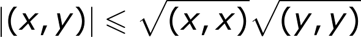
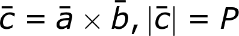
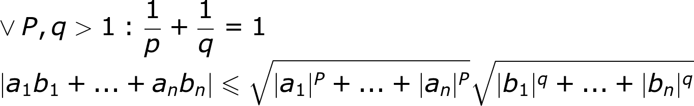
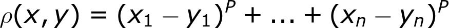

# Выч. Мат. 

	Владимир Александрович Панкратов - лектор
	Павловский Ян Юрьевич - семинарист

## Семинар 1 (07.02.2019)

Численные методы??? 

Повторение, как решать СЛАУ методом Гаусса

Повторение, что такое норма:

Правила нормы:

ρ = расстояние между двумя векторами

Единичная и Евклидовы нормы...

(Ну сам посмотри в интернете, если надо, там понятнее объяснено будет))

Зачем-то пошёл разговор про поис корня уравнения различными методами: касательной, хорды, Ньютона ...

Неравенство Коши-Гуняковского

Его геометрическое доказательство:

Как находим площадь паралелаграмма построенного на векторах a и b: 

Матрица Грама : 

ЧТО-ТО НОВОЕ ?

Неравенство Минковского: 

![\sqrt[P]{|a_1+b_1|^P+...+|a_n+b_n|^P} \leqslant \sqrt[P]{|a_1|^P+...+|a_n|^P} + \sqrt[P]{|b_1|^P+...+|b_n|^P}](files/1_7.png)

Неравенство Гельдера:

Метрика, но не норма

## Лекция 1 (12.02.2019)

### Введение в вычислительную математику

	Предмет и метод вычислительной математики
	Понятие математической модели, вычислительного эксперимента, вычислительной задачи

Вычислительная математика == методы вычислений == вычислительные методы == численные методы == ...

В настоящее время выработалась технология исследования сложных проблем, основанная на построении и анализе с помощью ЭВМ математических моделей изучаемого объекта. 

	слайд 3

__Математическая модель__ изучаемого объекта - математическое описание поведения объекта исследования, как правило, в форме системы уравнений(алгеб, дифф, интеграл, тд ), реже - неравенств или включений. 

Анализ мат модели на ЭВМ - __вычислительный эксперимент__. 

Метод исследлования,  в котором для изучения объекта используется его математическая модель, называется __математическим моделированием__. 

	слайд 4

Последовательное исследование выглядит следующим образом: 

  1. Формулируется основные законы, определяющие поведение данного объекта исследования
  2. строится соответствующая мат модель предст обычно запись этих законов в форме системе ур. 
  3. Ставится вычислительная задача
  4. Разрабатывается вычислительный метод для решения полученной вычислительной задачи
  5. Состовляется программа на ЭВМ, реализующая вычислительный метод
  6. Проводятся вычисление и анализ рез-тов. 

...

	слайд 5+6

####  Вычислительные задачи

__Вычислительная задача__ - задача имеющая мат формулу вида: _F(x,y) = 0_, где требуется по исходным данным определить _x_ и _y_   

В тех случаях, когда задач имеет вид _y = ƒ(x)_ , где  _ƒ_ - однозначная функция, задачу называют прямой: задача вида _ƒ(y) = x_ называют обратной

	пример: y = sin (x) - прямая
	пример: e^(-y) - y = x - обратная

...	

	слайд 7

#### Метрическое пространство

Множество _М_ называется __метрическим пространством__, если определена функция _ρ : M x M -> r_ удовлетворяющая для всех _a,b E M_ след. аксиомам:
  1. ρ(a,b) = 0 <=> a = b
  2. ρ(a,b) = ρ(b,a)
  3. ρ(a,c) ≤  ρ(a,b) + ρ(b,c)

При этом ρ называется метрикой или расстоянием на М
  
	слайд 8  
  
Математическое пространство изолированных точек 

Для  произвольного множества _М_ метрика может быть определена как 

Пример Метрическое пространство изол точек служит только для илюстрации а для содержательных задач оно абсолютно бесполезно

__Метрическое пространство r__

Множество дейст чисел |R явл метрическим прострам=нством с расстоянием  _ρ(a,b) =  |a - b|_

	слайд 9
	
__Название слайда__
	
ОПР. __Арифметическим вектором n-ого порядка__  называется упорядоченный набор _a = (a1, a2, ... an)_ из _n_ действительных чисел _ak E r_. Множество арифметических векторов n-ого порядка обозначается как |R^n. На множестве |R^n могут использоаться следующие метрики: 

	слайд 10
	
__Метрическое пространство _С([a,b]_)__

Множество непрерывных на отрезке [a,b] фунций обозначается как _С([a,b]_

Расстояние между функциями _f,g E С([a,b]_ может быть определено любым из следующих способов:

	слайд 11
	
&&

	слайд 12
	
Пример

Пример

	слайд 13
	
__Корректность вычислительной задачи__

ОПР. Вычислительная задача _F(x,y) = 0_ называется __корректной__, если она устойчива и для любых исходных данных _x_  решение _y_ существует и единственно. 

Пример: _y = sin(x)_ по данному _x E r_ явл. корректной вычислительной задачей
	
Пример:Задача поиска корня _y E R_ уравнения _y^2 

Замечание

	слайд 14
	
__Вычислительные методы__

ОПР. Методы решения вычислительных задач - __вычислительные методы__

Выделяют следующие общие вычислительные методы:

  1. Прямые методы и методы эквивалентных преобразований
  2. Итеррационные методы
  3. Методы аппроксимации
  4. Методы статистических испытаний (Метод Монте-Карло). 

...

	слайд 15
	
__Прямые методы__

ОПР. __Прямые методы__ - методы, позволяющие получить решение исходной вычислительной задачи за конкретное число операций. 

Пример: Метод решения СЛАУ

по формулам Крамера

	слайд 16
	
__Итерационные методы__

ОПР. __Итерационные методы__ - методы построения последловательности приближений к решению исходной вычислительной задачи

Пример: Для вычисления _y = √x_ по данному _x_ рассматривается последовательность _yk_	 построенная по следующему правилу:

Можно показать, что _lim(k->∞) yk = y_

iuwrui

	слайд 17 + слайд 18
	
__Методы апроксимации__

ОПР. __Методы апроксимации__ - методы в кот. исходная вычислительная задача заменяется приближенной, решаемой за конечное число операций. 

Пример:
	
Пример: Задача Коши
	
	слайд 19 + 20 + 21 + 22

__Методы Монте-Карло для вычисления площадей__

ОПР. __Методы Монте-Карло__ - методы, в кот. для нахождения приближенного решения вычислит. задачи проводится серия случайных экспериментов. 

	Использоваь мы их толком не будем
	
Примерыы

	слайд 23
	
__Выч. алг__

ОПР. __Выч. алг__ - выч. метод детализированный до степени, позволяющий реализацию на 

## Семинар 2 (14.02.2019)

## Лекция 2 (19.02.2019) 

## Семинар 3 (21.02.2019)

